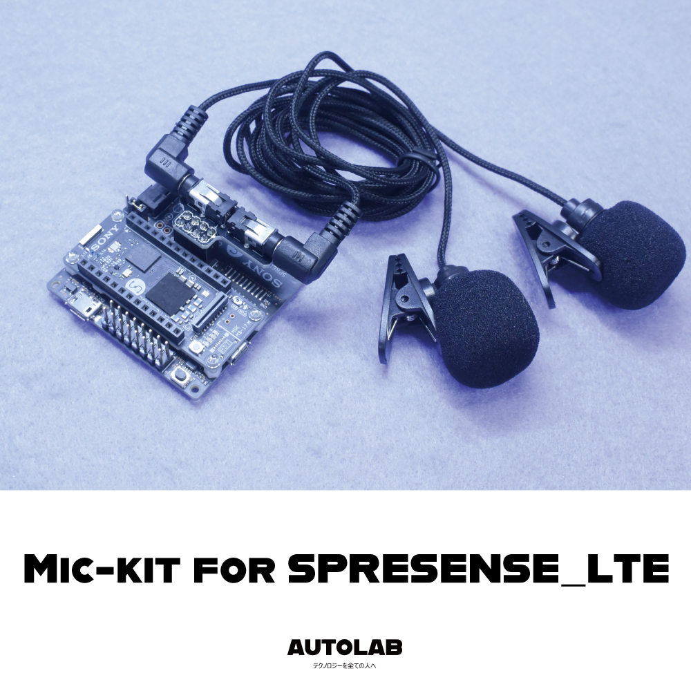
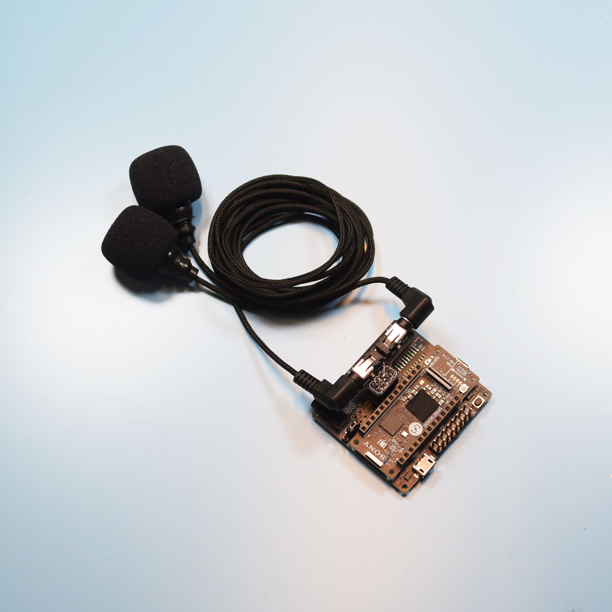

# 2Mic KIT for SPRESENSES_LTE サポートページ

## 概要
本キットをSPRESENSE_LTEに接続することで
マイク2本を実装することができ、
アプリケーションの開発を行うことができます

*SPRESENSEおよび、LTE拡張基板、カメラ基板は付属しません

## 同梱物

・アナログマイク2本

・LTE基板

## 使い方
### 1.SPRESENSEをご用意ください

SPRESENSE本体とLTE拡張基板をご用意ください

*本キットには含まれておりません

### 2.MICを接続

付属しているマイクは、アナログマイクです

